# Ripple Social Media Platform

Ripple is a modern social media platform developed as part of the Constructor Academy Full-Stack Development Bootcamp. This repository contains the frontend implementation, created collaboratively by a team of three developers over an intensive one-week sprint.
[View Backend/Fullstack Repository](https://github.com/JoelEmmanuel795/Ripple-Social-Media-Fullstack)

## Live Demo

You can access the deployed version of Ripple here:  
[https://joelemmanuel795.github.io/Ripple-Social-Media/](https://joelemmanuel795.github.io/Ripple-Social-Media/)

## Project Overview

Ripple demonstrates modern web development practices, implementing a feature-rich social media platform with real-time interactions, responsive design, and a polished user interface. Built with React and leveraging contemporary frontend technologies, this project showcases our ability to create production-ready web applications with complex state management and user interactions.

## Features

### Authentication & User Management

- Secure user registration and login system
  <p align="center">
  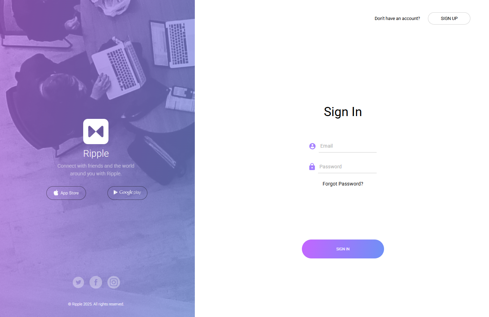
  </p>
- Profile customization and management
  <p align="center">
  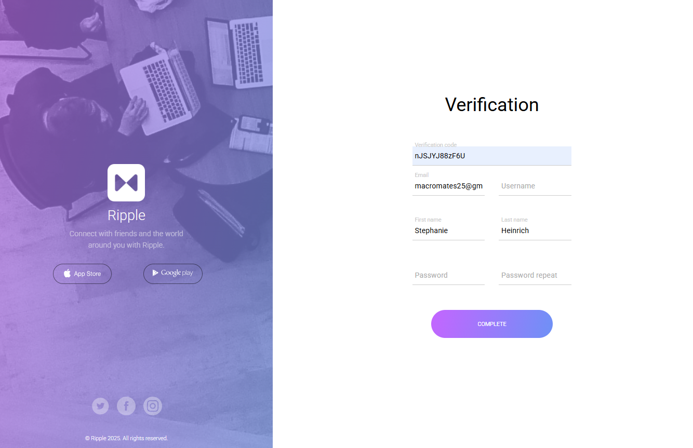
  </p>
- Privacy-focused user settings

### Social Feed Management

- Intuitive homepage with infinite scrolling feature
  <p align="center">
  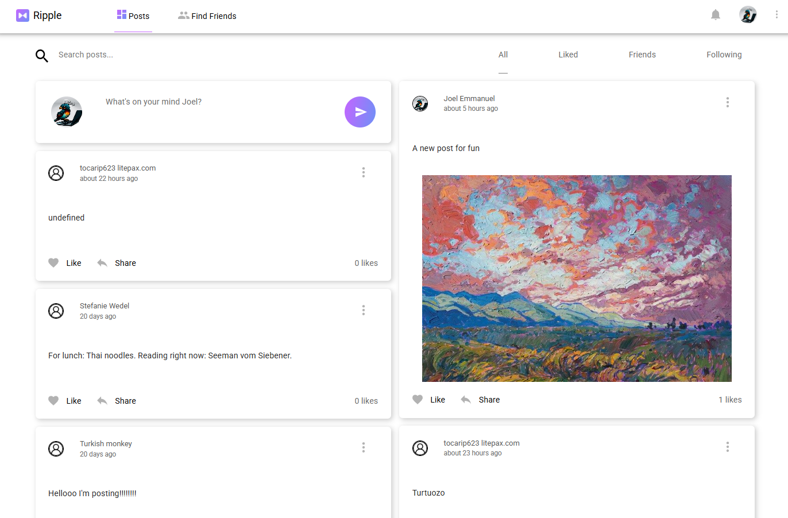
  </p>
- Dynamic post creation with multi-image support
  <p align="center">
  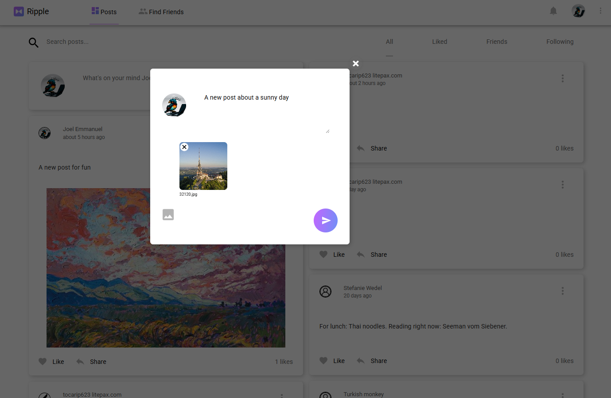
  </p>
- Real-time post updates and editing capabilities
- Post deletion with user confirmation
  <p align="center">
  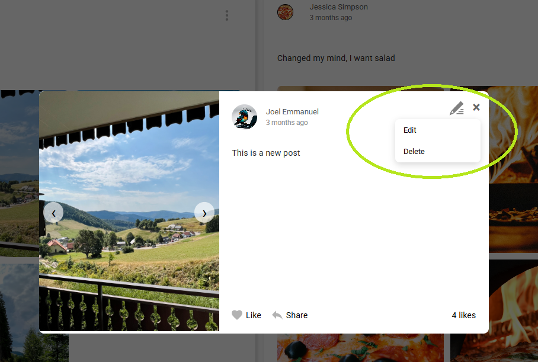
  </p>

### Content Filtering & Organization

- Advanced post filtering system:
    - Liked posts filter
    - Friends' posts view
    - Following feed filter
        <p align="center">
        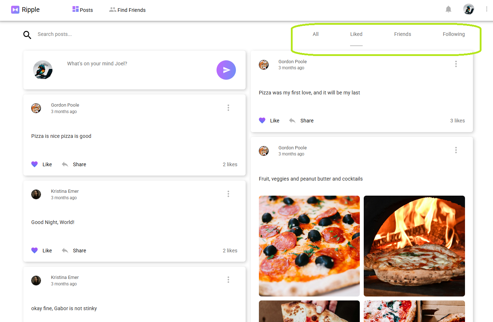
        </p>

### Social Interactions

- Real-time notification center
- Interactive friend request system
  <p align="center">
  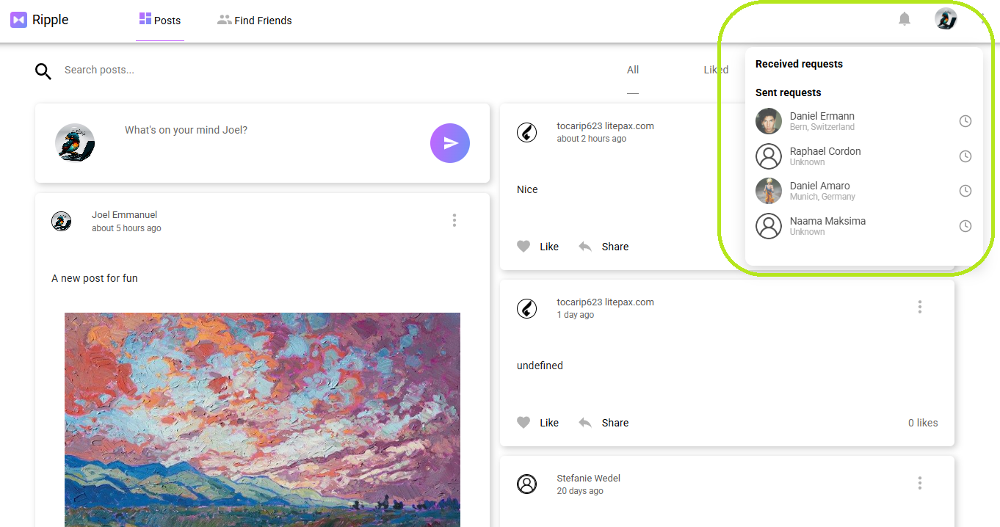
  </p>
- Intuitive post liking system
- Seamless post sharing functionality
  <p align="center">
  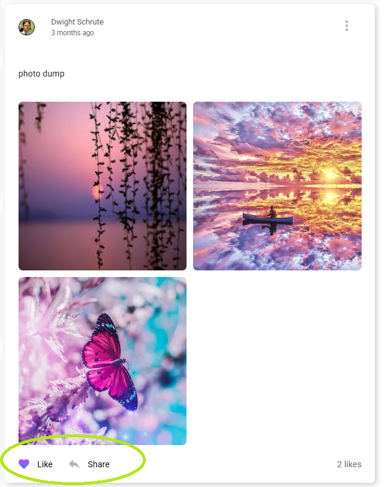
  </p>

### User Connections

- Friend discovery and suggestion system
- Follow/Unfollow functionality
- Friend request management
- Network building tools
  <p align="center">
  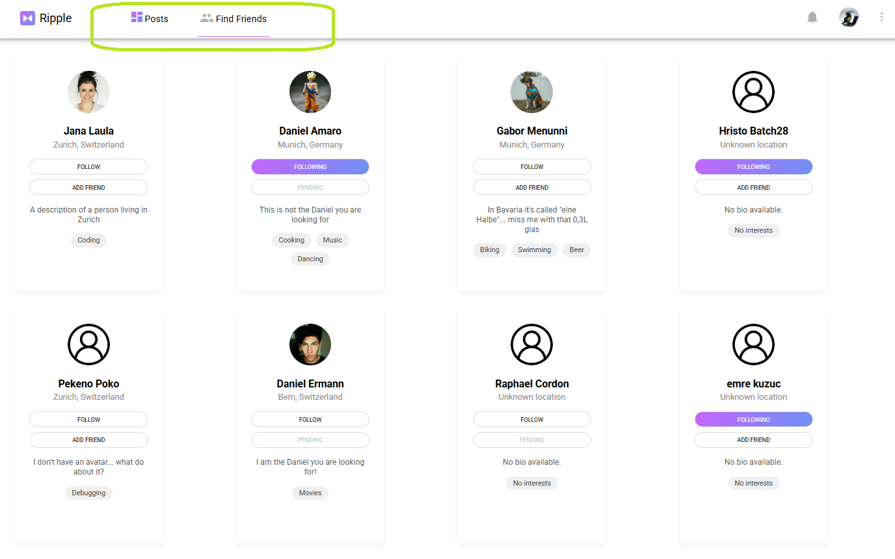
  </p>

### Profile Customization

- Comprehensive profile editing
  <p align="center">
  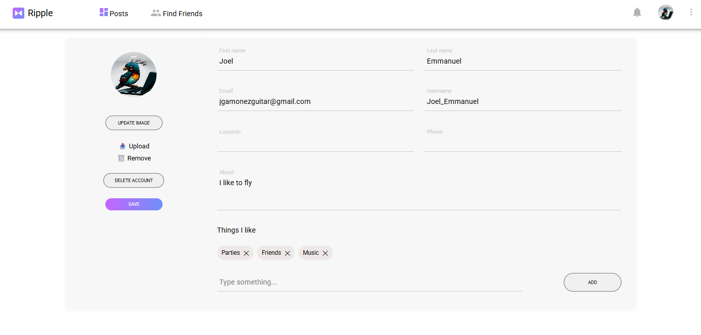
  </p>
- Privacy settings management
- Activity tracking and history
  <p align="center">
  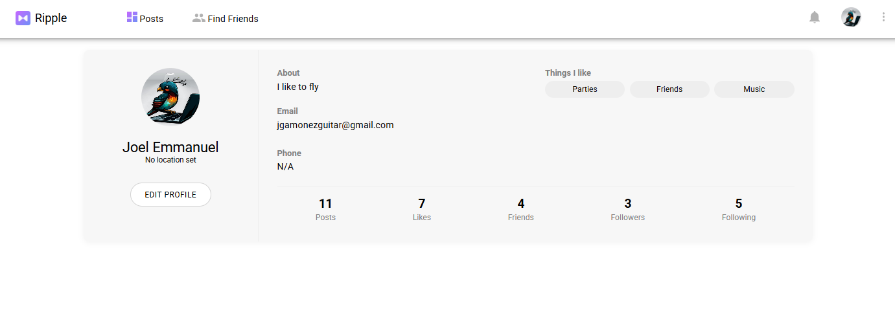
  </p>

## Tech Stack

### Core Technologies

- **React** (v19) - Frontend framework
- **Vite** (v6) - Build tool and development environment
- **Redux Toolkit** - State management
- **React Router** (v7) - Client-side routing
- **Axios** - HTTP client for API requests

### Styling & UI

- **SASS** - Advanced CSS preprocessing
- **react-masonry-css** - Masonry layout for post displays
- **lucide-react** - Modern icon system

### Development Tools

- **ESLint** - Code quality and style enforcement
- **Prettier** - Code formatting
- **SWC** - Fast JavaScript/TypeScript compiler

## Installation & Setup

```bash
# Clone the repository
git clone https://github.com/JoelEmmanuel795/Ripple-Social-Media.git

# Navigate to project directory
cd Ripple-Social-Media

# Install dependencies
npm install

# Start development server
npm run dev

# Build for production
npm run build
```

## Development

```bash
# Run SASS compiler in watch mode
npm run sass

# Format code
npm run format

# Lint code
npm run lint
```

## Deployment

The application is configured for GitHub Pages deployment:

```bash
# Deploy to GitHub Pages
npm run deploy
```

## Team & Acknowledgments

Developed as part of the Constructor Academy Full-Stack Development Bootcamp by:

- Joel Gamonez
- Philippe Giarvinni
- Andrea Lombardo

## Connect & Contribute

Feel free to explore the codebase, submit issues, or reach out for collaboration. The backend repository is available [here](https://randomlink.com).

## License

[Add your chosen license]
